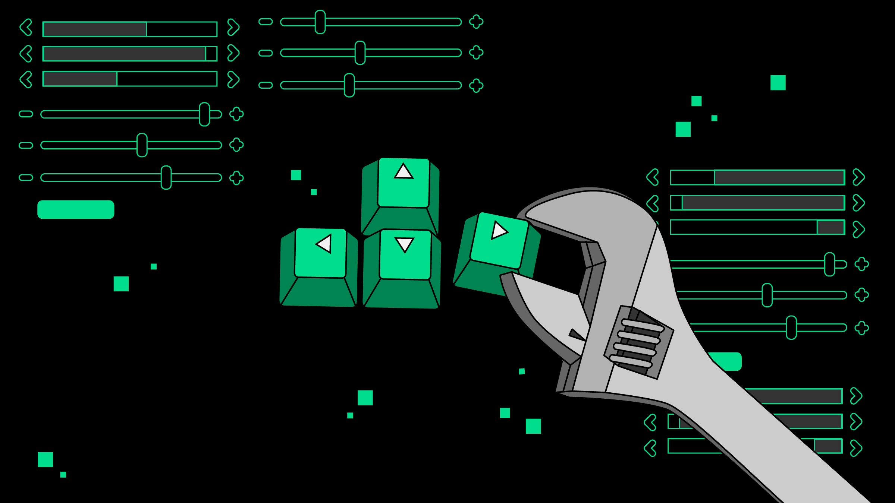

# FallFinder 🔎
**Note: the source code of the program cannot be shared as it is a property of Arm Ltd**
## ❗ Team 42 ❗
* **Zachariah Newbery** - GPU: Runtime Diagnostics
* **Anurag Suresh** - CPU: System Validation with OS 
* **Xuan Zhao** - OSS: Morello Kernel
* **Mughees Asif** - DSG: Online Tools

    

### Motivation
----

    

#### Introduction
Falls and fractures are a common and serious health issue faced by people in England. People aged 65 and older have the highest risk of falling; around a third of people aged 65 and over, and around half of people aged 80 and over, fall at least once a year. Falling is a cause of distress, pain, injury, loss of confidence, loss of independence and mortality.

> Today, we present to you **FallFinder**🔎. A handy tool to detect the causes of falling and predict the likelihood of a fall in the future. The application notifies the carer if a fall happens allowing for a faster response time.
#### Statistics1
* The Public Health Outcomes Framework (PHOF) reported that in 2017 to 2018 there were around 220,160 emergency hospital admissions related to falls among patients aged 65 and over, with around 146,665 (66.6%) of these patients aged 80 and over. 
* Falls were the 9th highest cause of disability-adjusted life years (DALYs) in England in 2013 and the leading cause of injury. 
* Unaddressed fall hazards in the home are estimated to cost the NHS in England **£435 million**. 
* The total annual cost of fragility fractures to the UK has been estimated at £4.4 billion which includes £1.1 billion for social care; hip fractures account for around £2 billion of this sum.
* Short and long-term outlooks for patients are generally poor following a hip fracture, with an increased one-year mortality of between 18% and 33% and negative effects on daily living activities such as shopping and walking. 
* A review of long-term disability found that around 20% of hip fracture patients entered long-term care in the first year after the fracture. 
* Falls in hospitals are the most commonly reported patient safety incident with more than 240,000 reported in acute hospitals and mental health trusts in England and Wales.
### Setup
----

    

#### General
* Clone the repo: `git clone git@git.research.arm.com:zacnew01/team-42-project.git`
* Install dependencies: `python3 setup.py install`
* Open terminal and run: `python3 run_webcam.py --model=mobilenet_thin --resize=432x368 --camera=0 --tensorrt=True`

Alternatively, a Google Colab notebook `Team42.ipynb` has also been setup to do parts of the main program. While it does do fall detection, it does not yet have the email notification functionality nor the facial recognition that the main program has due to the restrictions on Colab.

#### Custom facial Recognition
* If the user wants to add their own face to the facial recognition database, they would need to upload a few images of themselves under `./images/{YOUR_NAME}`.
* The current iteration uses a pre-downloaded database so creating a new database would require the user to make a new `images` folder, as the database was too large to upload to the repository.
* Open a terminal and run: `python3 generate_face_db.py`
* This will create a `face_enc` file at the root of the project folder containing the encoding of the faces in the database to be used by the deep learning model.
### Tech. stack
----

      
      
    

### Architecture
----

    

* The basic premise of the application is to use the **[OpenPose](https://github.com/CMU-Perceptual-Computing-Lab/openpose)** library to detect keypoints and estimate the pose of the human body according to the *cartesian coordinate system* (XY-axis) using pre-trained deep learning models.
* The detection is based on the falling person’s head, and as they fall a drastic change in the coordinates’ of the head are monitored.
* These differences are stored in an array or buffer and compared with any previous coordinates. 
* If the difference is negative, a "Fall Detected" sign is displayed on the screen.
* **[SMTP Lib](https://docs.python.org/3/library/smtplib.html)** is then used to send an email to the carer, and HTML is used to format the email.
* The instance at which the fall occurs is then encoded and attached to the notification email for the carers to access.
* The fall is then stored in a database for future reference.

##### **NOTE**: the fall detection system currently relies on a pre-trained deep learning model, but this can be changed to a custom model.
### Future iterations
----

    

* Facial recognition in combination with the falling pose detection do not currently work together, and will be added to the application.
* The application will be integrated with real-time SMS notifications, allowing the carers to be notified of the falling person’s location.
* The application will be extended to include detection of other ailments including strokes, seizures, and micro-facial expressions.
* Functionality to facially-scan through the members of the organisation to automatically extract the pertinent features of the user to train the model. This will allow automatic updates to the user database and makes sure that all facial features are recognised. 
### Difficulties encountered   
----  
* There may be some false-detection as the coordinates of the head are in the [normalized form](https://www.albany.edu/faculty/jmower/geog/gog530Python/src/NormalizingCoordinatesManual.html).
* Hardware limitation was an issue in the initial implementation of the application.
* Time was also limited to allow optimal training of the model. 

### References   
----  
1Government of the United Kingdom. 2020. *Falls: applying All Our Health*. [online] Available at: <https://www.gov.uk/government/publications/falls-applying-all-our-health/falls-applying-all-our-health> [Accessed 23 July 2021].
